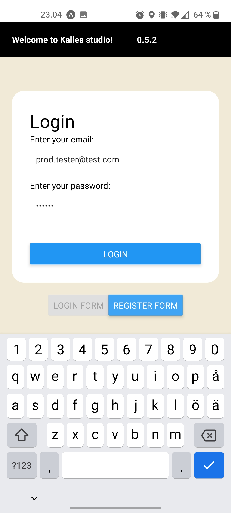
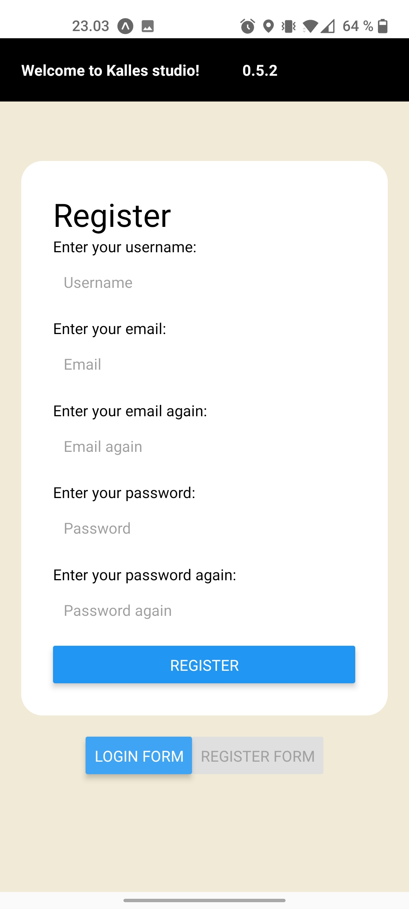
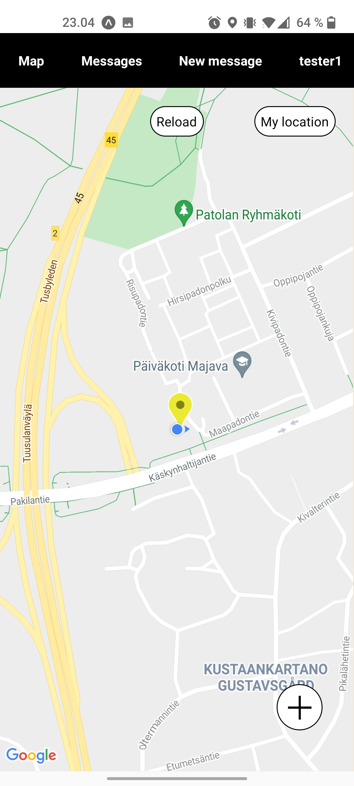
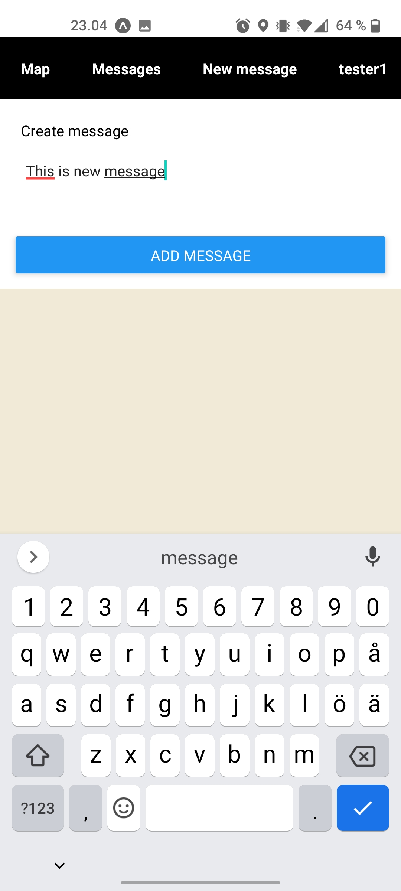
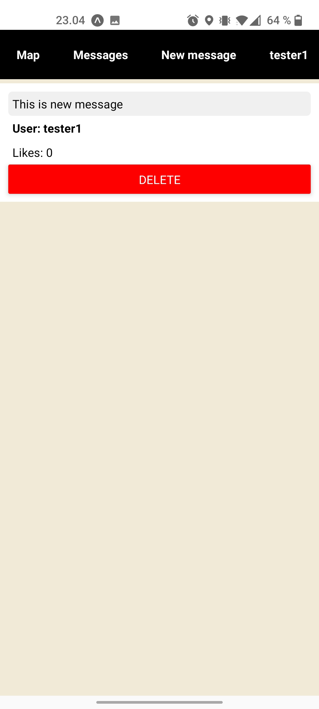
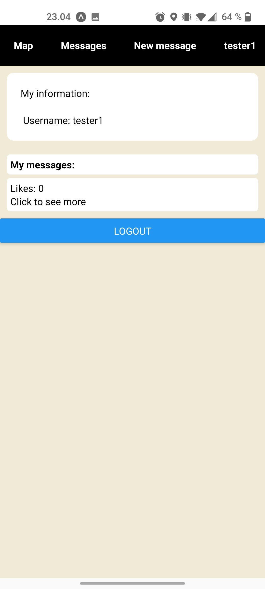

# Get started

To run application locally check [client README.md](./client/README.md) and [server README.md](./server/README.md)

- [Get started](#get-started)
	- [Expo go](#expo-go)
	- [Snippets](#snippets)
		- [Login](#login)
		- [Register](#register)
		- [Map page](#map-page)
		- [New message page](#new-message-page)
		- [Message page](#message-page)
		- [User page](#user-page)
	- [Known bugs](#known-bugs)
		- [Location](#location)

## Expo go
To run application with expo go you need:
1. Open project page: https://expo.dev/@velivalentine/kalles-studios
2. Download [expo-go](https://expo.dev/client)
3. Open expo-go application
4. scan the qr-code in project page with expo go
5. Allow location

## Snippets

### Login

### Register

### Map page

### New message page

### Message page

### User page

## Known bugs
### Location
Sometimes the application doesn't get current location after allowing location permissiont to expo-go. 

Possible fix:
1. Open expo-go
2. Open project
3. Allow location
4. Close project
5. Open project again