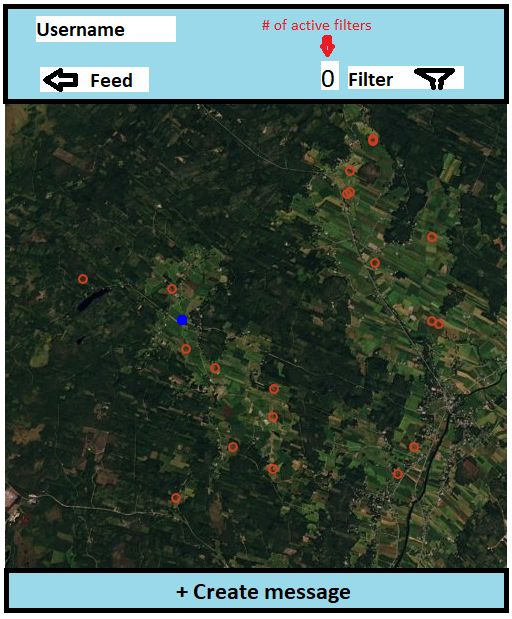

The App is messaging app (kind of like snapchat) but the messages are binded to location. 

Example of use:
User opens the application. After login a map of local area opens. There are red dots displayed in 15km radius of users location. Red dots turn green when user is physically next to them.

These dots are messages from other users. A message can be text, picture, video or voicemail.

User can filter shown dots on the map using filter function. Filtering can be done by likes, location, date created or/and times viewed.

When user is close enough to a message it turns green. Then the message is available to tuser to read. 

User can leave own messages. This is done vie new message button. New messages contains location information, date created, user id, likes and the message. 
